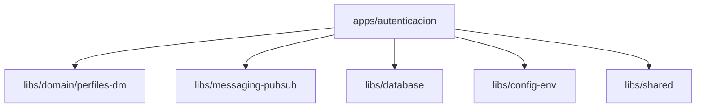
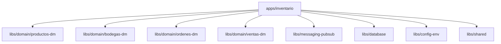
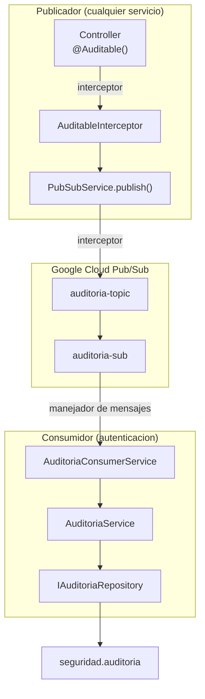
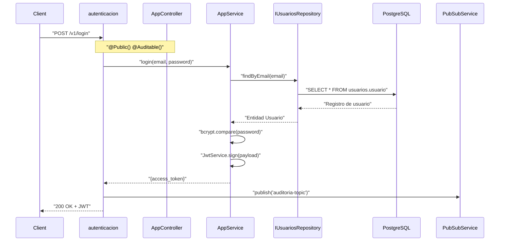
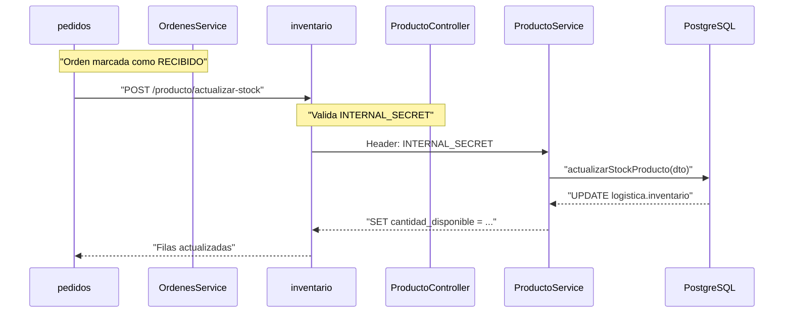
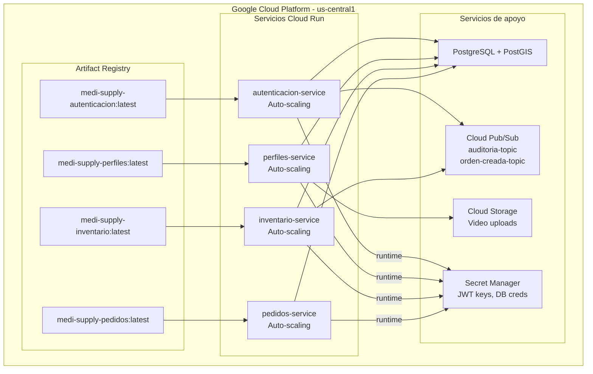
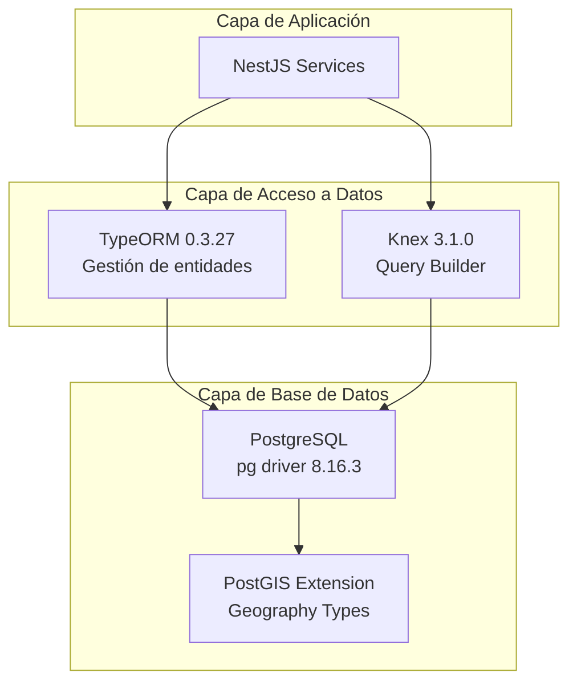
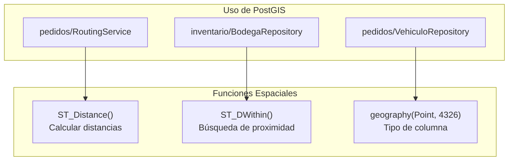
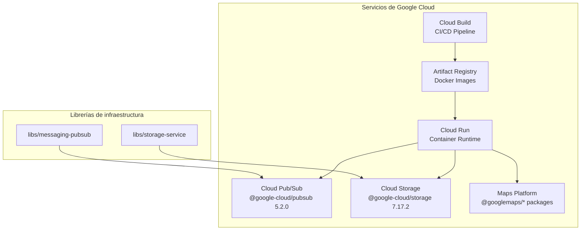

# Backend-MediSupply (Monorepo con Nx)

Repositorio monorepo creado con Nx. Contiene múltiples servicios (apps) y librerías compartidas (libs) para facilitar el desarrollo y la reutilización de código.


## Overview

El backend de MediSupply es una plataforma de gestión de la cadena de suministro de insumos médicos basada en microservicios, diseñada para manejar inventario de productos, cumplimiento de pedidos, perfiles de usuarios y logística para la distribución de insumos médicos. El sistema gestiona el ciclo de vida completo de los productos médicos desde los proveedores hasta los clientes, incluyendo gestión de bodegas, optimización de rutas de entrega y programación de visitas.

Este documento ofrece una vista arquitectónica de alto nivel del sistema, describiendo los servicios centrales, sus interacciones y la infraestructura que los soporta. 
---

## Arquitectura de Microservicios

El sistema consta de **cuatro microservicios independientes basados en NestJS** desplegados como aplicaciones contenedorizadas en Google Cloud Run. Cada servicio es propietario de un dominio de negocio distinto y se comunica mediante APIs HTTP y mensajería asíncrona.

### Estructura del repositorio

El código está organizado como un **monorepo Nx** con clara separación entre aplicaciones y librerías compartidas.

**Fuentes:** [package.json L1-L80](https://github.com/Grupo8-MediSupply/Backend-MediSupply/blob/1d044696/package.json#L1-L80)

 [package-lock.json L1-L100](https://github.com/Grupo8-MediSupply/Backend-MediSupply/blob/1d044696/package-lock.json#L1-L100)

---

## Responsabilidades de los Servicios

Cada microservicio se despliega como un servicio independiente en Cloud Run con su propio Dockerfile y punto de entrada.

### Descripción de servicios

| Servicio | Nombre del paquete | Responsabilidades principales | Entidades clave |
| --- | --- | --- | --- |
| **autenticacion** | `@medi-supply/autenticacion` | Autenticación JWT, validación de inicio de sesión, registro de auditoría | Usuario |
| **perfiles** | `@medi-supply/perfiles` | Perfiles de usuario (vendedores, proveedores, clientes), programación de visitas, subida de videos | Vendedor, Cliente, Proveedor, VisitaCliente |
| **inventario** | `@medi-supply/inventario` | Catálogo de productos, gestión de bodegas, control de stock, creación de órdenes | Producto, Bodega, Lote, Inventario, Orden |
| **pedidos** | `@medi-supply/pedidos` | Cumplimiento de pedidos, asignación de vehículos, optimización de rutas, seguimiento de entregas | OrdenEntrega, RutaGenerada, Vehiculo |

**Fuentes:** [package-lock.json L85-L160](https://github.com/Grupo8-MediSupply/Backend-MediSupply/blob/1d044696/package-lock.json#L85-L160)

 [apps/autenticacion/Dockerfile L1-L37](https://github.com/Grupo8-MediSupply/Backend-MediSupply/blob/1d044696/apps/autenticacion/Dockerfile#L1-L37)

 [apps/perfiles/Dockerfile L1-L37](https://github.com/Grupo8-MediSupply/Backend-MediSupply/blob/1d044696/apps/perfiles/Dockerfile#L1-L37)

 [apps/inventario/Dockerfile L1-L37](https://github.com/Grupo8-MediSupply/Backend-MediSupply/blob/1d044696/apps/inventario/Dockerfile#L1-L37)

 [apps/pedidos/Dockerfile L1-L37](https://github.com/Grupo8-MediSupply/Backend-MediSupply/blob/1d044696/apps/pedidos/Dockerfile#L1-L37)

---

## Librerías de Modelos de Dominio

El sistema utiliza **librerías de modelos de dominio compartidas** (`libs/domain/*`) para definir entidades e interfaces de repositorio. Estas librerías son importadas por múltiples servicios para asegurar modelos de datos consistentes en todo el sistema.

### Patrón de registro de módulos

Cada aplicación sigue un patrón consistente de registro de módulos en NestJS, importando modelos de dominio y servicios de infraestructura a través de sus APIs públicas:

```mermaid
flowchart TD

AppModule["AppModule<br>(Módulo raíz)"]
ConfigModule["MediSupplyConfigEnvModule"]
DBModule["MediSupplyDatabaseModule"]
SharedModule["MediSupplySharedModule"]
DomainModule["Módulo de Dominio<br>(p. ej., MediSupplyPerfilesDmModule)"]
FeatureModules["Módulos de Funcionalidad<br>(p. ej., VendedoresModule)"]

AppModule --> ConfigModule
AppModule --> DBModule

## Arquitectura de Despliegue

Los cuatro microservicios se despliegan de forma independiente en Google Cloud Run, con compilaciones incrementales gestionadas por la detección de afectados de Nx.

### Servicios en Cloud Run

```mermaid
flowchart TD

DB["PostgreSQL + PostGIS"]
AuthImg["medi-supply-autenticacion:latest"]
AuthRun["autenticacion-service<br>Auto-scaling"]
PerfilesImg["medi-supply-perfiles:latest"]
PerfilesRun["perfiles-service<br>Auto-scaling"]
InventarioImg["medi-supply-inventario:latest"]
InventarioRun["inventario-service<br>Auto-scaling"]
PedidosImg["medi-supply-pedidos:latest"]
PedidosRun["pedidos-service<br>Auto-scaling"]
PubSub["Cloud Pub/Sub<br>auditoria-topic<br>orden-creada-topic"]
Storage["Cloud Storage<br>Video uploads"]
SecretMgr["Secret Manager<br>JWT keys, DB creds"]

subgraph subGraph3 ["Google Cloud Platform - us-central1"]
    AuthImg --> AuthRun
    PerfilesImg --> PerfilesRun
    InventarioImg --> InventarioRun
    PedidosImg --> PedidosRun
    AuthRun --> DB
    PerfilesRun --> DB
    InventarioRun --> DB
    PedidosRun --> DB
    AuthRun --> PubSub
    InventarioRun --> PubSub
    PerfilesRun --> Storage
    AuthRun -->|"runtime"| SecretMgr
    PerfilesRun -->|"runtime"| SecretMgr
    InventarioRun -->|"runtime"| SecretMgr
    PedidosRun -->|"runtime"| SecretMgr

subgraph subGraph2 ["Servicios de apoyo"]
    DB
    PubSub
    Storage
    SecretMgr
end

subgraph subGraph1 ["Artifact Registry"]
    AuthImg
    PerfilesImg
    InventarioImg
    PedidosImg
end

subgraph subGraph0 ["Servicios Cloud Run"]
    AuthRun
    PerfilesRun
    InventarioRun
    PedidosRun
end
end
```

Cada servicio en Cloud Run:

* Se autoescalan según la carga de peticiones entrantes
* Inyectan secretos desde Google Secret Manager en tiempo de ejecución
* Se conectan a una instancia compartida de PostgreSQL con la extensión PostGIS
* Se despliegan solo cuando su código fuente cambia (a través de la detección de afectados de Nx)

**Fuentes:** Basado en el pipeline CI/CD y diagramas de despliegue que muestran la arquitectura en Google Cloud Run.

---

## Grafo de Dependencias

Las referencias del proyecto TypeScript definen el grafo de dependencias entre aplicaciones y librerías.

### Dependencias de Aplicaciones

**Aplicación `autenticacion`:**



Definido en [apps/autenticacion/tsconfig.app.json L23-L38](https://github.com/Grupo8-MediSupply/Backend-MediSupply/blob/1d044696/apps/autenticacion/tsconfig.app.json#L23-L38)

 y [apps/autenticacion/tsconfig.json L5-L27](https://github.com/Grupo8-MediSupply/Backend-MediSupply/blob/1d044696/apps/autenticacion/tsconfig.json#L5-L27)

**Aplicación `inventario`:**



Definido en [apps/inventario/tsconfig.app.json L23-L47](https://github.com/Grupo8-MediSupply/Backend-MediSupply/blob/1d044696/apps/inventario/tsconfig.app.json#L23-L47)

 y [apps/inventario/tsconfig.json L5-L36](https://github.com/Grupo8-MediSupply/Backend-MediSupply/blob/1d044696/apps/inventario/tsconfig.json#L5-L36)

Las referencias de dependencias imponen límites arquitectónicos: las aplicaciones solo pueden importar desde sus dependencias de librería declaradas explícitamente, evitando dependencias circulares y manteniendo la separación de responsabilidades.

**Fuentes:** [apps/autenticacion/tsconfig.app.json L23-L38](https://github.com/Grupo8-MediSupply/Backend-MediSupply/blob/1d044696/apps/autenticacion/tsconfig.app.json#L23-L38)

 [apps/autenticacion/tsconfig.json L5-L27](https://github.com/Grupo8-MediSupply/Backend-MediSupply/blob/1d044696/apps/autenticacion/tsconfig.json#L5-L27)

 [apps/inventario/tsconfig.app.json L23-L47](https://github.com/Grupo8-MediSupply/Backend-MediSupply/blob/1d044696/apps/inventario/tsconfig.app.json#L23-L47)

 [apps/inventario/tsconfig.json L5-L36](https://github.com/Grupo8-MediSupply/Backend-MediSupply/blob/1d044696/apps/inventario/tsconfig.json#L5-L36)

 [tsconfig.json L1-L64](https://github.com/Grupo8-MediSupply/Backend-MediSupply/blob/1d044696/tsconfig.json#L1-L64)

---
    inventario-->>pedidos: "Filas actualizadas"
```

Este patrón asegura consistencia inmediata para operaciones críticas (deducción de stock) que no pueden ser eventualmente consistentes.

**Fuentes:** Basado en diagramas del sistema que muestran comunicación servicio a servicio con el encabezado `INTERNAL_SECRET`.

### Patrón 3: Mensajería Asíncrona (Pub/Sub)

Operaciones no críticas, como el registro de auditoría, usan Google Cloud Pub/Sub para asegurar consistencia eventual.



El decorador `@Auditable()` está implementado como un interceptor de NestJS que publica eventos después de la finalización exitosa de la petición. El `AuditoriaConsumerService` en [apps/autenticacion/src/app/auditoria/auditoria-consumer.service.spec.ts L30-L62](https://github.com/Grupo8-MediSupply/Backend-MediSupply/blob/1d044696/apps/autenticacion/src/app/auditoria/auditoria-consumer.service.spec.ts#L30-L62)

se suscribe a los mensajes y los persiste.

**Fuentes:** [apps/autenticacion/src/app/app.controller.ts L17](https://github.com/Grupo8-MediSupply/Backend-MediSupply/blob/1d044696/apps/autenticacion/src/app/app.controller.ts#L17-L17)

 [apps/autenticacion/src/app/auditoria/auditoria-consumer.service.spec.ts L1-L97](https://github.com/Grupo8-MediSupply/Backend-MediSupply/blob/1d044696/apps/autenticacion/src/app/auditoria/auditoria-consumer.service.spec.ts#L1-L97)

---
* Bodegas: `/v1/bodegas/*`
* Órdenes: `/v1/ordenes/*`
* Reportes: `/v1/reportes/*`
* Planes de venta: `/v1/planes-venta/*`

**`pedidos` endpoints:**

* Órdenes de entrega: `/v1/ordenes-entrega/*`
* Rutas: `/v1/rutas/*`

**Sources:** [apps/autenticacion/src/app/app.controller.ts L7-L22](https://github.com/Grupo8-MediSupply/Backend-MediSupply/blob/1d044696/apps/autenticacion/src/app/app.controller.ts#L7-L22)

---

## Patrones de comunicacion

El sistema emplea tres patrones de comunicación distintos según los requisitos de consistencia y preferencias de acoplamiento.

### Patrón 1: HTTP Síncrono (Cliente a Servicio)

Los clientes externos (web/mobile) se comunican con los servicios mediante APIs REST protegidas por autenticación JWT.



El decorador `@Public()` marca endpoints que omiten la verificación JWT, mientras que `@Auditable()` dispara la publicación asíncrona de eventos de auditoría.

**Fuentes:** [apps/autenticacion/src/app/app.controller.ts L15-L20](https://github.com/Grupo8-MediSupply/Backend-MediSupply/blob/1d044696/apps/autenticacion/src/app/app.controller.ts#L15-L20)

### Patrón 2: HTTP Servicio-a-Servicio

El servicio `pedidos` realiza llamadas HTTP síncronas al servicio `inventario` para actualizar stock usando un token secreto interno para autenticación.



Este patrón asegura consistencia inmediata para operaciones críticas (deducción de stock) que no pueden ser eventualmente consistentes.

**Fuentes:** Basado en diagramas del sistema que muestran comunicación servicio a servicio con la cabecera `INTERNAL_SECRET`.

### Patrón 3: Mensajería Asíncrona (Pub/Sub)

Operaciones no críticas, como el registro de auditoría, usan Google Cloud Pub/Sub para asegurar consistencia eventual.


El decorador `@Auditable()` está implementado como un interceptor de NestJS que publica eventos después de la finalización exitosa de la petición. El `AuditoriaConsumerService` en [apps/autenticacion/src/app/auditoria/auditoria-consumer.service.spec.ts L30-L62](https://github.com/Grupo8-MediSupply/Backend-MediSupply/blob/1d044696/apps/autenticacion/src/app/auditoria/auditoria-consumer.service.spec.ts#L30-L62)

se suscribe a los mensajes y los persiste.

**Fuentes:** [apps/autenticacion/src/app/app.controller.ts L17](https://github.com/Grupo8-MediSupply/Backend-MediSupply/blob/1d044696/apps/autenticacion/src/app/app.controller.ts#L17-L17)

 [apps/autenticacion/src/app/auditoria/auditoria-consumer.service.spec.ts L1-L97](https://github.com/Grupo8-MediSupply/Backend-MediSupply/blob/1d044696/apps/autenticacion/src/app/auditoria/auditoria-consumer.service.spec.ts#L1-L97)

---


## Arquitectura de Despliegue

Los cuatro microservicios se despliegan de forma independiente en Google Cloud Run, con compilaciones incrementales gestionadas por la detección de afectados de Nx.

### Servicios en Cloud Run



Cada servicio en Cloud Run:

* Se autoescalan según la carga de peticiones entrantes
* Inyectan secretos desde Google Secret Manager en tiempo de ejecución
* Se conectan a una instancia compartida de PostgreSQL con la extensión PostGIS
* Se despliegan solo cuando su código fuente cambia (a través de la detección de afectados de Nx)

---


## Fundamento Tecnológico

Todo el sistema se construye sobre un stack tecnológico consistente definido en el `package.json` raíz:

| Categoría | Tecnologías |
| --- | --- |
| Framework | `@nestjs/common@^11.0.0`, `@nestjs/core@^11.0.0` |
| Servidor HTTP | `@nestjs/platform-fastify@^11.1.6` |
| ORM de Base de Datos | `typeorm@^0.3.27`, `knex@^3.1.0`, `pg@^8.16.3` |
| Autenticación | `@nestjs/jwt@^11.0.1`, `@nestjs/passport@^11.0.5`, `passport-jwt@^4.0.1`, `bcrypt@^6.0.0` |
| Validación | `class-validator@^0.14.2`, `class-transformer@^0.5.1` |
| Google Cloud | `@google-cloud/pubsub@^5.2.0`, `@google-cloud/storage@^7.17.2` |
| Maps | `@googlemaps/google-maps-services-js@^3.4.2`, `@googlemaps/routing@^2.1.1` |
| Documentación API | `@nestjs/swagger@^11.2.1`, `@fastify/swagger@^9.5.2`, `@fastify/swagger-ui@^5.2.3` |
| Herramientas de Build | `nx@21.6.4`, `typescript@~5.9.2` |

**Fuentes:** [package.json L49-L79](https://github.com/Grupo8-MediSupply/Backend-MediSupply/blob/1d044696/package.json#L49-L79)

 [package-lock.json L17-L46](https://github.com/Grupo8-MediSupply/Backend-MediSupply/blob/1d044696/package-lock.json#L17-L46)

---

## Preocupaciones Transversales

Varias librerías de infraestructura proporcionan funcionalidades compartidas entre todos los servicios:

### @medi-supply/shared

Exporta guards, decoradores e interceptores:

* `JwtAuthGuard` - Valida tokens JWT en endpoints protegidos
* `RolesGuard` - Aplica control de acceso basado en roles
* `@Public()` decorador - Marca endpoints como públicamente accesibles
* `@Roles()` decorador - Especifica roles requeridos para endpoints
* `@Auditable()` decorador - Dispara la publicación de eventos de auditoría

### @medi-supply/config-env

Proporciona carga centralizada de variables de entorno vía `ConfigModule` de `@nestjs/config`.

### @medi-supply/database

Exporta `MediSupplyDatabaseModule` que configura pools de conexión de TypeORM con PostgreSQL.

### @medi-supply/messaging-pubsub

Envuelve el cliente de Google Cloud Pub/Sub, exponiendo:

* `PubSubService.publish(topic, message)` - Publica mensajes
* `PubSubService.subscribe(subscription, handler)` - Registra manejadores de mensajes

### @medi-supply/storage-service

Envuelve el cliente de Google Cloud Storage para operaciones de subida de archivos usadas por el servicio `perfiles`.

**Fuentes:** [apps/autenticacion/src/app/app.module.ts L1-L74](https://github.com/Grupo8-MediSupply/Backend-MediSupply/blob/1d044696/apps/autenticacion/src/app/app.module.ts#L1-L74)

 [apps/perfiles/src/app/app.module.ts L1-L35](https://github.com/Grupo8-MediSupply/Backend-MediSupply/blob/1d044696/apps/perfiles/src/app/app.module.ts#L1-L35)

 [apps/inventario/src/app/app.module.ts L1-L34](https://github.com/Grupo8-MediSupply/Backend-MediSupply/blob/1d044696/apps/inventario/src/app/app.module.ts#L1-L34)


---

# Stack Tecnológico

# Technology Stack

> **Archivos fuente relevantes**
> * [package-lock.json](https://github.com/Grupo8-MediSupply/Backend-MediSupply/blob/1d044696/package-lock.json)
> * [package.json](https://github.com/Grupo8-MediSupply/Backend-MediSupply/blob/1d044696/package.json)


## Stack de Frameworks Backend

El sistema utiliza **NestJS 11.0.0** como framework de aplicación emparejado con **Fastify** como servidor HTTP, reemplazando el adaptador por defecto de Express. Esta combinación ofrece una arquitectura robusta, orientada a TypeScript, con buenas características de rendimiento.

### Framework NestJS

NestJS proporciona la base estructural para los cuatro microservicios (`autenticacion`, `perfiles`, `inventario`, `pedidos`). Proporciona:

* **Inyección de dependencias** mediante decoradores (`@Injectable()`, `@Inject()`)
* **Sistema de módulos** para organizar límites de servicio
* **Middleware y guards** para preocupaciones transversales
* **Enrutamiento basado en decoradores** (`@Controller()`, `@Get()`, `@Post()`)
* **Integración OpenAPI incorporada** vía `@nestjs/swagger`

Fuentes: [package.json L58-L65](https://github.com/Grupo8-MediSupply/Backend-MediSupply/blob/1d044696/package.json#L58-L65)

### Servidor HTTP Fastify

El sistema utiliza `@nestjs/platform-fastify` (v11.1.6) en lugar de Express por optimización de rendimiento. Fastify proporciona:

* **2-3x mayor rendimiento en el manejo de peticiones** comparado con Express
* **Validación basada en esquemas** vía JSON Schema
* **Arquitectura de plugins** para extensibilidad
* **Soporte async/await nativo** sin complejidad de middleware

Cada microservicio inicializa Fastify mediante `NestFactory`:

```javascript
// Patrón usado en todos apps/*/src/main.ts
const app = await NestFactory.create<NestFastifyApplication>(
  AppModule,
  new FastifyAdapter()
);
```

Fuentes: [package.json L64](https://github.com/Grupo8-MediSupply/Backend-MediSupply/blob/1d044696/package.json#L64-L64)

### Dependencias clave del framework

| Paquete | Versión | Propósito |
| --- | --- | --- |
| `@nestjs/common` | 11.0.0 | Decoradores, pipes, guards centrales |
| `@nestjs/core` | 11.0.0 | Arranque de la aplicación |
| `@nestjs/platform-fastify` | 11.1.6 | Adaptador HTTP Fastify |
| `@nestjs/config` | 4.0.2 | Configuración de entorno |
| `@nestjs/swagger` | 11.2.1 | Documentación OpenAPI |
| `@nestjs/axios` | 4.0.1 | Integración del cliente HTTP |

Fuentes: [package.json L49-L79](https://github.com/Grupo8-MediSupply/Backend-MediSupply/blob/1d044696/package.json#L49-L79)

---

## Capa de Persistencia de Datos

El sistema emplea una **estrategia dual-ORM**: TypeORM para la gestión de entidades y Knex para consultas complejas, ambos operando sobre una base de datos PostgreSQL con extensiones PostGIS.



**Diagrama: Stack tecnológico de persistencia de datos**

Fuentes: [package.json L70-L78](https://github.com/Grupo8-MediSupply/Backend-MediSupply/blob/1d044696/package.json#L70-L78)

### Configuración de TypeORM

TypeORM (v0.3.27) gestiona definiciones de entidades y operaciones CRUD básicas. Cada librería de modelo de dominio (`perfiles-dm`, `productos-dm`, `ordenes-dm`) define entidades usando decoradores de TypeORM:

* `@Entity()` - Mapeo de tabla
* `@Column()` - Definición de campos
* `@ManyToOne()`, `@OneToMany()` - Relaciones
* `@PrimaryGeneratedColumn()` - Claves auto-incrementales

La librería `database` (en `libs/database`) provee la configuración y gestión de conexiones de TypeORM.

Fuentes: [package.json L78](https://github.com/Grupo8-MediSupply/Backend-MediSupply/blob/1d044696/package.json#L78-L78)

 [package-lock.json L46](https://github.com/Grupo8-MediSupply/Backend-MediSupply/blob/1d044696/package-lock.json#L46-L46)

### Knex Query Builder

Knex (v3.1.0) maneja consultas complejas que son difíciles de expresar en TypeORM, en particular:

* **Joins entre múltiples tablas** con condiciones complejas
* **Consultas SQL en bruto** para funciones espaciales de PostGIS
* **Gestión de transacciones** para operaciones multi-paso
* **Scripts de migración** (aunque las migraciones se manejan por separado)

Este enfoque dual balancea productividad del desarrollador (entidades TypeORM) con flexibilidad de consultas (Knex).

Fuentes: [package.json L70](https://github.com/Grupo8-MediSupply/Backend-MediSupply/blob/1d044696/package.json#L70-L70)

 [package-lock.json L38](https://github.com/Grupo8-MediSupply/Backend-MediSupply/blob/1d044696/package-lock.json#L38-L38)


### PostgreSQL con PostGIS

La capa de base de datos utiliza **PostgreSQL** accediendo mediante el driver `pg` (v8.16.3). La extensión **PostGIS** habilita operaciones geoespaciales críticas para:

* **Enrutamiento basado en ubicación** en el servicio `pedidos`
* **Cálculos de proximidad de bodegas** usando `ST_Distance()`
* **Coordenadas geográficas** almacenadas como tipos `geography(Point, 4326)`

Las columnas espaciales aparecen en:

* `logistica.bodega.ubicacion_geografica` - Ubicaciones de bodegas
* `logistica.vehiculo.ubicacion` - Posiciones en tiempo real de vehículos
* `usuarios.usuario.ubicacion` - Direcciones de usuarios/clientes

Fuentes: [package.json L75](https://github.com/Grupo8-MediSupply/Backend-MediSupply/blob/1d044696/package.json#L75-L75)



**Diagrama: Uso de funciones espaciales de PostGIS**

Fuentes: Basado en los Diagramas 2 y 4 de la arquitectura de alto nivel

---

## Infraestructura en la Nube (Google Cloud Platform)

Toda la infraestructura se ejecuta en **Google Cloud Platform**, aprovechando servicios gestionados para escalabilidad y menor carga operativa.

### Google Cloud Run

Cada uno de los cuatro microservicios se despliega como un servicio independiente en **Cloud Run**:

* **Despliegue basado en contenedores** con autoescalado (0 a N instancias)
* **Facturación por petición**
* **Provisionamiento automático de HTTPS**
* **Despliegue regional** en `us-central1`

El despliegue se desencadena mediante Google Cloud Build cuando se detectan cambios en el repositorio.

Fuentes: Basado en el Diagrama 5 de la arquitectura de alto nivel

### Google Cloud Pub/Sub

La librería cliente `@google-cloud/pubsub` (v5.2.0) habilita mensajería asíncrona entre servicios. El envoltorio `libs/messaging-pubsub` proporciona una interfaz compatible con NestJS.

**Topics y suscripciones:**

* Topic `auditoria` - Publicación de eventos de auditoría
* Suscripción `auditoria-sub` - Consumo de eventos de auditoría
* Topic `orden-creada` - Eventos de creación de órdenes

Patrones clave:

* **Publicación fire-and-forget** para eventos no críticos (registro de auditoría)
* **Entrega garantizada** con ack para eventos críticos (cambios de estado de órdenes)
* **Colas de mensajes muertos (dead letter queues)** para procesamientos fallidos

Fuentes: [package.json L53](https://github.com/Grupo8-MediSupply/Backend-MediSupply/blob/1d044696/package.json#L53-L53)

 [package-lock.json L21](https://github.com/Grupo8-MediSupply/Backend-MediSupply/blob/1d044696/package-lock.json#L21-L21)

### Google Cloud Storage

La librería cliente `@google-cloud/storage` (v7.17.2) gestiona subidas de archivos, específicamente:

* **Evidencia en video** para visitas a clientes (servicio `perfiles`)
* **URLs firmadas** para acceso temporal y seguro
* **Organización de buckets** por tipo de contenido y patrones de acceso

La librería `libs/storage-service` envuelve las operaciones de GCS con métodos async compatibles con NestJS.

Fuentes: [package.json L54](https://github.com/Grupo8-MediSupply/Backend-MediSupply/blob/1d044696/package.json#L54-L54)

 [package-lock.json L22](https://github.com/Grupo8-MediSupply/Backend-MediSupply/blob/1d044696/package-lock.json#L22-L22)

### Google Cloud Build

El flujo CI/CD se ejecuta en **Google Cloud Build**, definida en `cloudbuild.yaml`. La pipeline realiza:

1. Detecta las aplicaciones afectadas usando Nx
2. Construye imágenes Docker para cada aplicación afectada
3. Empuja las imágenes a **Google Artifact Registry**
4. Despliega las imágenes actualizadas en Cloud Run


### Google Maps Platform

Las librerías `@googlemaps/google-maps-services-js` (v3.4.2) y `@googlemaps/routing` (v2.1.1) aportan:

* **Optimización de rutas** para la programación de entregas
* **Cálculos de matrices de distancia** entre bodegas y clientes
* **Geocodificación** para la validación de direcciones
* **Enrutamiento sensible al tráfico** para estimaciones de llegada (ETAs) más realistas

Estas se usan exclusivamente en los servicios `inventario` y `pedidos` para operaciones logísticas.

Fuentes: [package.json L55-L56](https://github.com/Grupo8-MediSupply/Backend-MediSupply/blob/1d044696/package.json#L55-L56)

 [package-lock.json L23-L24](https://github.com/Grupo8-MediSupply/Backend-MediSupply/blob/1d044696/package-lock.json#L23-L24)



**Diagrama: Dependencias de servicios en Google Cloud Platform**

Fuentes: [package.json L49-L79](https://github.com/Grupo8-MediSupply/Backend-MediSupply/blob/1d044696/package.json#L49-L79)

---